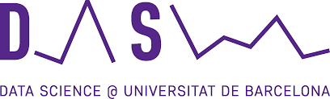

# Data Science UB

The master's degree Fundamental Principles of Data Science provides students with the algorithmic and mathematical basis needed for the correct modelling and analysis of data through practical oriented sessions, as well as the professional skills necessary to tackle data-based projects. In the course, the emphasis is placed on skills related to understanding the foundations of the algorithms behind data science and to modifying and creating specific new algorithms tailored to the needs of data projects.  

The master's degree course includes topics ranging from numerical linear algebra, optimization and probabilistic programming, to machine learning, deep learning, complex networks, and recommender techniques. It also covers the application of these to natural language processing, temporal series and information extraction from images, using technologies capable of storing and processing large volumes of data: "big data".

# Subjects
_________________
* [OPTIMIZATION](./OPT)
* [NUMERICAL LINEAR ALGEBRA](./NLA)
* [VISUALIZATION](./VIS)
* [AGILE DATA](./EDS)
* [MACHINE LEARNING](./ML)
* [DEEP LEARNING](./DL)
_________________
* [BAYESIAN STATISTICS AND PROBABILISTIC PROGRAMMING](./EB)
* [ETHICAL DATA SCIENCE](./EDS)
* [BIG DATA](./BD)
* [RECOMMENDER SYSTEMS](./RS)
* [COMPLEX NETWORKS](./CN)
* [COMPUTER VISION](./CV)
* [NATURAL LANGUAGE PROCESSING](./NLP)
* [PROBABILISTIC GRAPHICAL MODELS](./PGM)
